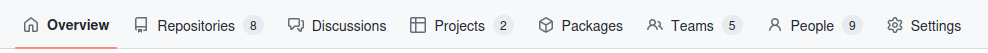

# GitHub
This tutorial aims to provide a brief overview of GitHub and the team management/organization features it provides. In particular it will look at the aspects of GitHuub which are relavent for the UMATT elctrical/software team. For more detailed information about GitHib and it's features, check out their [documentation](https://docs.github.com/en). But enough chit-chat, let's dive in!

## What is GitHub?
GitHub was originally created to help software developers manage their source code, provide version control, and allow for collaboration. In recent years, however, GitHub has introduced many new features to their website in order to help organize your team and track tasks/bugs (called _issues_). It also provides features for team communication, access control, wiki documentation, and pipeline automation! While a number of their newest features have been locked behind a paid "GitHub Enterprise" subscription, their free version still offers a ton of helpful features for team management and project organization.

## Creating an Account
In order to use GitHub, you'll need to create a free account. Go to [https://github.com/](https://github.com/) and click on the **Sign-up** option in the upper right corner. Follow the prompts, entering your email (I'm not sure if your school email will work) and provide a secure password, display username, and email preferences. Once that has been completed, you'll need a security code sent to your email in order to activate your account. Lastly, there are some optional personalization questions.

And that's all there is to it! You are officially the owner of your very own GitHub account. Yay :D! Feel free to explore your dashboard and get a feel for the site, or customize your account profile. Once you've satisfied your curiosity, it's time to jump into official UMATT stuff. In order to gain proper access to the UMATT GitHub organization, we'll need to add you as a member. Please reach out the team's Electrical Lead with your profile _Username_, we'll do our best to get you added in to the team in a timely manner.

> **Note:** Once UMATT GitHub invitations go out, they will expire after a week. Should be plenty of time, but don't say I didn't tell ya.

## UMATT ECE Organization
The first thing you'll want to do is find the **umatt-ece** organization. You can find it by searching in the search bar (keyboard shortcut is `/`) for "umatt-ece" and then filtering by _users_. Or, just follow this [link](https://github.com/umatt-ece). You may need to wait until you are given proper team privileges before you can access all the features of the UMATT GitHub, but feel free to explore the site to as much extent as you are able.

> **Pro Tip:** You can _favourite_ an organization so that it appears on your personal dashboard and is much easier to navigate to in the future.

> **Note:** We are still figuring how to properly set up the UMATT GitHub account, if you don't have access to something you think you should, don't hesitate to reach out to the team's Electrical Lead (myself) and we'll get things sorted out.

Once on the organization GitHub page, you should be greeted by the _Overview Page_. This page isn't too important, but it will give you some quick links to repositories, discussion, and contributor profiles. Near the top of the page you should see a menu bar that looks something like:

Depending on your access level and which repository you are in, you may see more or less tabs in this menu bar. This is the main navigation bar for getting around the GitHub site, and following sections will give a brief overview of the various pages you can expect to find.

## Repositories
At the core of GitHub's structure is **repositories**. A repository is ....

Still some unanswered questions about repositories? Checkout GitHub's [documentation](https://docs.github.com/en/repositories). Or, for more information regarding how repositories are used in software management, checkout our other tutorial on [VersionControlSystems (git)](VersionControlSystems.md).

### Code

### Issues

### Pull Requests

## Discussions

## People

## Projects

### Roadmap

### Board

### Table