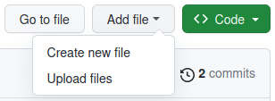

# GitHub
This tutorial aims to provide a brief overview of GitHub and the team management/organization features it provides. In particular, it will look at the aspects of GitHub which are relevant for the UMATT electrical/software team. For more detailed information about GitHub and it's features, check out their [documentation](https://docs.github.com/en). But enough chit-chat, let's dive in!

## What is GitHub?
GitHub was originally created to help software developers manage their source code, provide version control, and allow for collaboration. In recent years, however, GitHub has introduced many new features to their website in order to help organize your team and track tasks/bugs (called _issues_). It also provides features for team communication, access control, wiki documentation, and pipeline automation! While a number of their newest features have been locked behind a paid "GitHub Enterprise" subscription, their free version still offers a ton of helpful features for team management and project organization.

## Creating an Account
In order to use GitHub, you'll need to create a free account. Go to [github.com](https://github.com/) and click on the **Sign-up** option in the upper right corner. Follow the prompts, entering your email (I'm not sure if your school email will work, but you're welcome to give it a try) and provide a secure password, display username, and email preferences. Once that has been completed, you'll need a security code sent to your email in order to activate your account. Lastly, there are some optional personalization questions.

And that's all there is to it! You are officially the owner of your very own GitHub account. Yay :D! Feel free to explore your dashboard and get a feel for the site, or customize your account profile.

> **Pro Tip:** under _Appearance_, GitHub has an option for dark mode 😎️.

Once you've satisfied your curiosity, it's time to jump into official UMATT stuff. In order to gain proper access to the UMATT GitHub organization, we'll need to add you as a member. Please reach out the team's Electrical Lead with your profile _Username_, we'll do our best to get you added in to the team in a timely manner.

> **Note:** Once UMATT GitHub invitations go out, they will expire after a week. Should be plenty of time, but don't say I didn't tell ya.

## UMATT GitHub Organization
The first thing you'll want to do is find the **umatt-ece** organization. You can find it by searching in the search bar (keyboard shortcut is `/`) for "umatt-ece" and then filtering by _users_. Or, just follow this [link](https://github.com/umatt-ece). You may need to wait until you are given proper team privileges before you can access all the features of the UMATT GitHub, but feel free to explore the site to as much extent as you are able.

> **Pro Tip:** You can _favourite_ an organization so that it appears on your personal dashboard and is much easier to navigate to in the future.

> **Note:** We are still figuring how to properly set up the UMATT GitHub account, if you don't have access to something you think you should, don't hesitate to reach out to the team's Electrical Lead (myself) and we'll get things sorted out.

Once on the organization GitHub page, you should be greeted by the _Overview Page_. This page isn't too important, but it will give you some quick links to repositories, discussion, and contributor profiles. Near the top of the page you should see a menu bar that looks something like:

Depending on your access level and which repository you are in, you may see more or less tabs in this menu bar. This is the main navigation bar for getting around the GitHub site, and following sections will give a brief overview of the various pages you can expect to find.

## Repositories
At the core of GitHub's structure are **repositories**. You can think of a repository as a project folder. Each repository will contain files associated with the project, as well as GitHub data specific to that project (ex. _issues_, _wiki pages_, _actions_, etc...). But one of its most important features is the ability to keep track of file changes and provide version history for the code/documents within the repository (more on this shortly).

You've likely seen that there are a number of repositories within the UMATT organization, for example, the _new-members-package_ repository where this tutorial can be found! However, of all the repositories there are two that you should be extra aware of: **electrical-projects** and **software-projects**. These repositories contain general information, files, and _issues_ related to their respective sections.

If you want more detailed information about repositories, you can check out GitHub's [repository documentation](https://docs.github.com/en/repositories).

### Files
At its very core, a repository is designed to store and manage files. These could be text files (similar to this one), code, PDFs, images, or electrical drawings. Files can be added/edit in one of 2 ways:

1. Through the GitHub website 
2. Through any typical means, by first _cloning_ the repository to your local file system.

> We will discuss only the first method here. For more information about _cloning_ a repository, see the tutorial on [Version Control Systems](VersionControlSystems.md) and using [git](Git.md).

To add a file to a repository, first navigate to a repositories **code** tab:

Here you will be able to navigate and view the files/folders within the repository. At the top of the page there is an option to "Add file". You can either create a new text/code file or upload file(s) from your local computer.

When adding or editing files you'll see that it asks you to "Commit changes". _Commits_ are how GitHub tracks the history and changes to the repository. We will discuss them more shortly, but for now it is enough to know that any time you make a change to the repository it must be _committed_, and each commit can include an optional description of the change that is being made.

> You may have noticed by now that GitHub uses _Markdown_ formatted text files (.md) to add styling the documents it displays on the site. For more information about Markdown formatting see our [Markdown Tutorial](Markdown.md).

### Issues
Another major part of a repository is its _issues_. Originally created to track bugs in software (hence the name), issues have become much more than that. They allow team members to track bugs, tasks, and other information regarding the project/repository. You may also hear them referred to as "tickets" (if you've ever worked with [Jira Software](https://www.atlassian.com/software/jira) this will likely be what you are familiar with). Issues are linked to a particular repository, and can be found under the **Issues** tab:

This tab provides you with an overview of all the issues in the repository. You can filter/search for issues, group them by _labels_ or _milestones_, or create a new issue!

> We won't touch on _labels_ or _milestones_ here, but if you want to learn more about them, you check out this GitHub [guide to labels and milestones](https://docs.github.com/en/issues/using-labels-and-milestones-to-track-work).

You can click on any issue, and it will take you to a page showing more detailed information. Take for example the following issue:

- At the top there is an issue _title_ ("GitHub Navigation") and _ID_ (#4). This number is automatically assigned by GitHub such that every issue within the repository has a uniquely identifiable ID.
- Just below that you'll see the _status_ of the issue. AN issue can either be **open** or **closed**. When an issue is closed it is considered accomplished/resolved.
- Below that you'll see the initial _comment_. This describes the issue and should provide all the information needed to complete this ticket (if requirements change it can be edited at a later time).
- Not shown, there is a thread of comments and timeline of actions that extends below the initial comment. This allows other team members to provide input, and track progress on the issue.
- On the right-hand side you'll see a few different fields: _Assignees_, _Labels_, _Projects_, _Milestones_, _Development_, and _Notifications_. Note that for _Projects_, you can expand its fields with the **v** button to see additional information.

## Version Control
> This is just a brief introduction to Version Control, for more information check out our other tutorial on [Version Control Systems](VersionControlSystems.md).

One of the greatest features of GitHub (well... really it's a feature of _git_) is the ability to track changes to files, allow members to maintain their own copies of files, resolve conflicts that arise when multiple people edit the same file, and enforce review of changes. GitHub keeps track of these changes using _commits_.

Any time files are added, edited, or removed, the change is _committed_ to the repository. A commit has a unique ID, author, date/time, and an optional description of the change made. Every commit acts as a "snapshot" of the project at a given point in time (you can go back to a particular commit and see the exact state of the project at that time). Commits allows transparency between team members of what files were changed when, especially when multiple people start working on the same thing at the same time.

### Branches
Branches in Git/GitHub allow ...

### Pull Requests
...

## Typical Development Flow
With our new-found knowledge of issues, commits, branches, and pull requests, I'd like to take a brief moment to talk about the general Development Workflow for electrical/software projects. You may have heard variation of this in your classes, but this is the typical workflow that us at UMATT will be using. We'll go into more detail about this is our [Development Guidelines](DevelopmentGuidelines.md) document, so definitely check that out.

Every new task typically goes through the following stages:

1. A new _issue_ is created for the task, outlining the objective, requirements, and steps to follow.
2. A new _branch_ is created in which to make changes and update files. The describe task is now carried out
3. Once completed, a _pull request_ is made to add the changes into the main repository branch. Other team members should review the changes and provide feedback.
4. Once everyone is happy with the changes, the pull request is _approved_ and _merged_ into the main branch. The issue for the task can now be _closed_.

## Discussions

## People

## Projects

### Roadmap

### Board

### Table